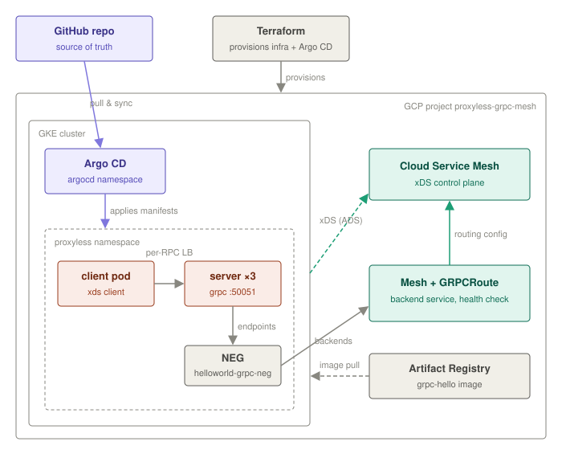

# Proxyless gRPC Service Mesh on GCP

[](grpc-mesh-infra/terraform)
[](https://cloud.google.com/kubernetes-engine)
[-34A853?logo=googlecloud&logoColor=white)](https://cloud.google.com/service-mesh/docs/service-routing/proxyless-overview)
[](grpc-mesh-infra/argocd)
[](https://github.com/noyblum/grpc-hello-app)

A complete, working **proxyless gRPC service mesh** on Google Cloud:
Terraform-provisioned GKE + Cloud Service Mesh, a Go gRPC server/client pair
speaking **xDS**, and everything Kubernetes-shaped delivered by **Argo CD**.

> **Companion repositories**
> - **Application repo** (Go source, proto, Dockerfile): [noyblum/grpc-hello-app](https://github.com/noyblum/grpc-hello-app)
> - **GitOps/IaC repo (this one):** Terraform, Kubernetes manifests, Argo CD application, technical write-up and docs.

---

## Why proxyless gRPC?

gRPC runs on HTTP/2: **one long-lived TCP connection, all requests multiplexed
over it**. Kubernetes Services + DNS balance at the *connection* level
(kube-proxy, L4), and DNS is resolved exactly once per connection - so every
RPC a client ever sends lands on the **same pod**. Scaling out adds pods that
receive zero traffic; rolling updates trigger reconnect storms; one replica
burns while its siblings idle.

A **proxyless service mesh** fixes this without adding a single proxy: the
gRPC library *inside the application* is an xDS client. It streams its
configuration - routes, endpoint lists, load-balancing policy, health state -
directly from Cloud Service Mesh's managed control plane, and balances
**every individual RPC** across live pod IPs. No sidecars, no extra network
hop, no DNS, no proxy fleet to operate.

The full analysis (root cause, comparison of Linkerd/Envoy/Istio/managed
meshes, and why this architecture wins on GCP) is in **[technical-review-proxyless-service-mesh.md](technical-review-proxyless-service-mesh.md)**.

## Architecture



| Component | Role |
|---|---|
| **Terraform** ([grpc-mesh-infra/terraform](grpc-mesh-infra/terraform)) | Provisions the entire GCP environment: APIs, VPC + firewall, GKE (Workload Identity, VPC-native), IAM, Artifact Registry, the Cloud Service Mesh resources, and Argo CD (Helm). |
| **Argo CD** (in-cluster, `argocd` namespace) | Owns everything application-shaped. Pulls this Git repo and applies `grpc-mesh-infra/k8s/proxyless-demo` into the `proxyless` namespace with automated sync, prune and self-heal. |
| **Mesh + GRPCRoute** | `Mesh grpc-mesh` is the configuration scope; `GRPCRoute helloworld-grpc-route` maps hostname `helloworld-gke` to the backend service. |
| **Backend service** | `helloworld-grpc-service` - protocol `GRPC`, scheme `INTERNAL_SELF_MANAGED` (mandatory for CSM), gRPC health check, backed by the GKE-created NEG. |
| **NEG** `helloworld-grpc-neg` | Created by GKE from the Service annotation `cloud.google.com/neg`; holds the server pod `IP:50051` endpoints. |
| **Server pods** (×3) | Plain gRPC Greeter + gRPC health protocol on :50051. Replies embed the pod hostname to make load balancing observable. |
| **Client pod** | Dials `xds:///helloworld-gke`. The grpc-go xDS resolver streams config from `trafficdirector.googleapis.com` and balances every RPC across the three pod IPs directly - no proxy, no DNS, no kube-proxy. |
| **td-grpc-bootstrap init container** | Generates the bootstrap file (`GRPC_XDS_BOOTSTRAP`) pointing the gRPC library at the control plane with `--config-mesh=grpc-mesh`. |

## Quick start

**Prerequisites:** a GCP project with billing, `gcloud` (authenticated +
`gcloud auth application-default login`), `terraform` ≥ 1.5, `kubectl`, `docker`.

```bash
# 1. Provision everything (GKE is the slow part, ~15 min)
cd grpc-mesh-infra/terraform
terraform init
terraform apply -var project_id=<PROJECT_ID>

# 2. Build & push the app image (from the application repo)
git clone https://github.com/noyblum/grpc-hello-app.git /tmp/grpc-hello-app
make -C /tmp/grpc-hello-app docker-push PROJECT_ID=<PROJECT_ID> TAG=v0.1.1

# 3. Hand the workloads to Argo CD
$(terraform output -raw get_credentials)
kubectl apply -f ../argocd/root-app.yaml

# 4. Once the server pods are Ready, attach the GKE-created NEG to the mesh
terraform apply -var project_id=<PROJECT_ID> -var attach_neg_backends=true
```

Full runbook with explanations: [docs/deployment.md](docs/deployment.md).

## How do I know it works?

**1. Watch per-RPC load balancing live** - replies rotate across all three
server pods over a *single* client channel:

```bash
kubectl logs -n proxyless deploy/helloworld-client -f
# reply: Hello ..., from helloworld-server-6f6ddf4db9-5xsf7
# reply: Hello ..., from helloworld-server-6f6ddf4db9-rdqqj
# reply: Hello ..., from helloworld-server-6f6ddf4db9-nm2ch
```

**2. Backend health** - all NEG endpoints pass the mesh's gRPC health check:

```bash
gcloud compute backend-services get-health helloworld-grpc-service --global
# healthState: HEALTHY ×3
```

**3. Argo CD UI** - `proxyless-demo` should be `Synced` / `Healthy`:

```bash
kubectl -n argocd get secret argocd-initial-admin-secret -o jsonpath='{.data.password}' | base64 -d
kubectl port-forward -n argocd svc/argocd-server 8080:80   # http://localhost:8080, user: admin
```

**4. The killer demo** - scale and watch new pods get traffic in seconds, with
zero reconnects:

```bash
kubectl -n proxyless scale deploy/helloworld-server --replicas=5
kubectl logs -n proxyless deploy/helloworld-client -f    # new pod names appear almost immediately
```

## Debugging

| Symptom | Where to look |
|---|---|
| Client: `DeadlineExceeded ... waiting for LB policy update` | The control plane has no healthy endpoints for the route: check `gcloud compute backend-services get-health` and that `attach_neg_backends=true` was applied |
| Endpoints `UNHEALTHY` | Server pod logs (is the app + health service actually serving?), firewall for `35.191.0.0/16, 130.211.0.0/22` → tcp:50051 |
| Server log: xDS Listener `NOT_SERVING` | You're running an `xds.NewGRPCServer` without server-side security policies - use a plain `grpc.Server` ([why](docs/troubleshooting.md#4-server-pods-healthy-but-endpoints-unhealthy--client-deadlineexceeded)) |
| Argo CD `ComparisonError` | Repo not reachable from the cluster: `kubectl exec -n argocd deploy/argocd-repo-server -- git ls-remote <repo> HEAD` |
| xDS internals | Set `GRPC_GO_LOG_SEVERITY_LEVEL=info`, `GRPC_GO_LOG_VERBOSITY_LEVEL=2` on the client pod |

Every issue actually hit while building this - with diagnosis paths and
before/after code - is documented in [docs/troubleshooting.md](docs/troubleshooting.md).

## Repository layout

```
technical-review-proxyless-service-mesh.md              # Part 1 - analysis, comparison, recommendation, references
assets/                 # architecture + xDS diagrams
docs/                   # deployment runbook, architecture, troubleshooting, evidence
grpc-mesh-infra/
  terraform/            # the whole GCP environment as code
  k8s/proxyless-demo/   # manifests delivered by Argo CD
  argocd/root-app.yaml  # the Argo CD Application (GitOps entry point)
```

## Assignment deliverables map

| Deliverable | Location |
|---|---|
| Task 1 & 2 - analysis, comparison, references | [technical-review-proxyless-service-mesh.md](technical-review-proxyless-service-mesh.md) |
| Task 3 - IaC (Terraform) | [grpc-mesh-infra/terraform/](grpc-mesh-infra/terraform/) |
| Task 4 - `server.go` | [grpc-hello-app · cmd/server/server.go](https://github.com/noyblum/grpc-hello-app/blob/main/cmd/server/server.go) |
| Task 5 - `client.go` | [grpc-hello-app · cmd/client/client.go](https://github.com/noyblum/grpc-hello-app/blob/main/cmd/client/client.go) |
| Dockerfile | [grpc-hello-app · Dockerfile](https://github.com/noyblum/grpc-hello-app/blob/main/Dockerfile) |
| Task 6 - Argo CD GitOps deployment | [grpc-mesh-infra/argocd/](grpc-mesh-infra/argocd/) + [grpc-mesh-infra/k8s/](grpc-mesh-infra/k8s/) |
| Evidence - screenshots & captured output | [docs/evidence.md](docs/evidence.md) |

## Teardown

```bash
kubectl delete -f grpc-mesh-infra/argocd/root-app.yaml   # Argo prunes the app resources
cd grpc-mesh-infra/terraform
terraform destroy -var project_id=<PROJECT_ID>
```
