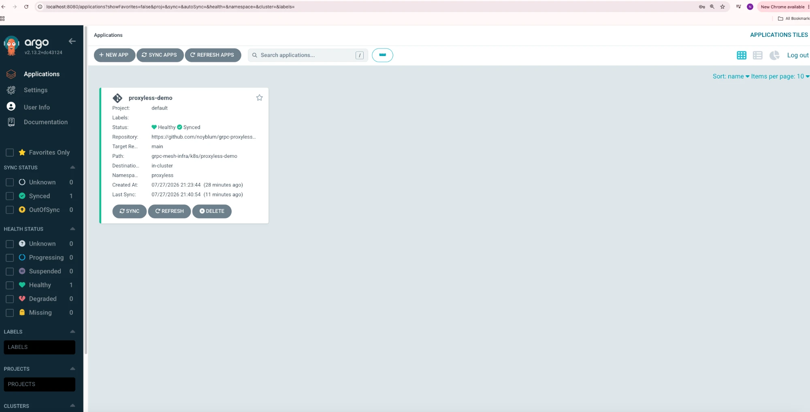
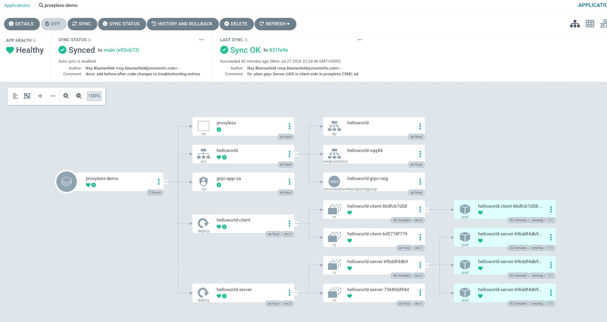

# Deployment evidence

## Argo CD — application synced and healthy

The `proxyless-demo` Application, synced from
`github.com/noyblum/grpc-proxyless-assignment` (`grpc-mesh-infra/k8s/proxyless-demo`),
deployed in-cluster to the `proxyless` namespace:



Resource tree — Deployments → ReplicaSets → 3 server pods + 1 client pod, the
NEG Service (`servicenetworkendpointgroup helloworld-grpc-neg`) and the
Workload Identity service account, all Healthy:



## Per-RPC load balancing (client logs)

Replies rotate across all three server pod hostnames — request-level balancing
over a single client channel, which DNS + kube-proxy can never do:

```
$ kubectl logs -n proxyless deploy/helloworld-client -f
reply: Hello helloworld-client-..., from helloworld-server-7568fdd94d-hwnxt
reply: Hello helloworld-client-..., from helloworld-server-7568fdd94d-ws7qj
reply: Hello helloworld-client-..., from helloworld-server-7568fdd94d-wtkp9
```

## Backend health

```
$ gcloud compute backend-services get-health helloworld-grpc-service --global
healthState: HEALTHY   (×3 NEG endpoints, port 50051)
```
